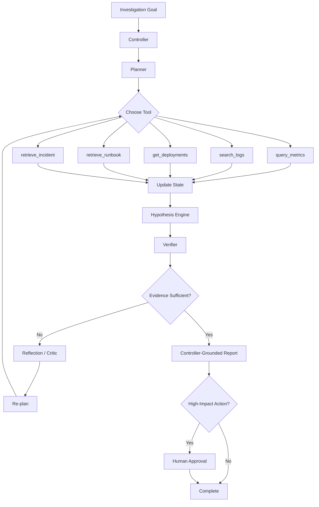
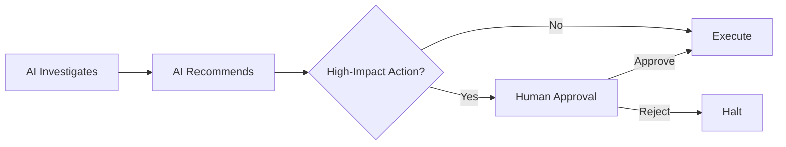
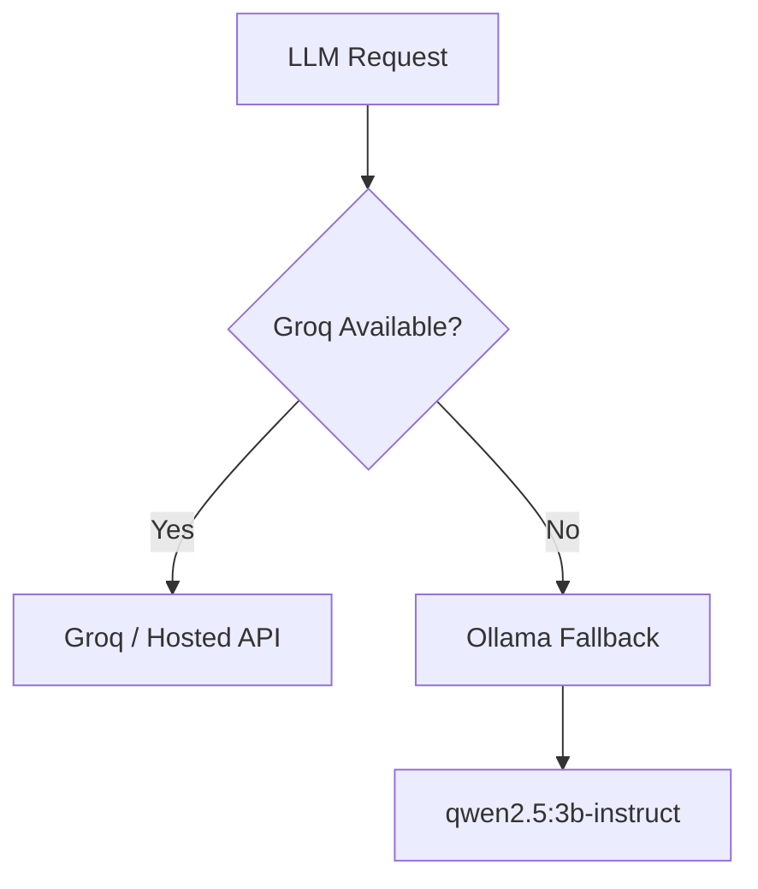

<div align="center">

# OpsPilot

**Autonomous Incident Investigation Agent for Evidence-Grounded SRE Workflows**

[](https://www.python.org/)
[](https://fastapi.tiangolo.com/)
[](https://streamlit.io/)
[](https://www.langchain.com/langgraph)
[](https://www.docker.com/)

`Observe → Investigate → Verify → Reflect → Re-plan → Report → Approve`

</div>

---

## Overview

OpsPilot is an agentic AI system that investigates service incidents the way an SRE would: it forms hypotheses, gathers operational evidence from multiple sources, checks whether that evidence actually supports a conclusion, and stops at a human-approval boundary before any high-impact action is taken.

Instead of following a fixed pipeline —

```
check metrics → check logs → check deployment → write report
```

OpsPilot continuously asks:

> **"What evidence do I need next to confidently explain this incident?"**

For a representative `checkout-api` latency incident, this looks like:

```
Recent deployment → Retry wrapper around DB writes → Database connection pressure
→ DB write timeouts / pool exhaustion → Increasing p95 latency → Evidence-grounded report
```

What matters is not just the final sentence the agent produces — it's how it got there, and OpsPilot records and evaluates that path.

## Table of Contents

- [Why This Is Agentic AI](#why-this-is-agentic-ai)
- [Architecture](#architecture)
- [Core Components](#core-components)
- [Tooling Layer](#tooling-layer)
- [Safety & Human Approval](#safety--human-approval)
- [LLM Strategy](#llm-strategy)
- [Retrieval-Augmented Knowledge](#retrieval-augmented-knowledge)
- [Observability](#observability)
- [Tech Stack](#tech-stack)
- [Project Structure](#project-structure)
- [Getting Started](#getting-started)
- [Running with Docker](#running-with-docker)
- [API Reference](#api-reference)
- [Evaluation](#evaluation)
- [Limitations](#limitations)
- [Roadmap](#roadmap)

## Why This Is Agentic AI

OpsPilot is not an LLM bolted onto a set of tools — it implements the full decision loop an autonomous agent needs:

| Agent Capability | OpsPilot Implementation |
|---|---|
| Goal interpretation | Investigation goal + service extraction |
| Planning | Planner / controller |
| Tool selection | Metrics, logs, deployment, and retrieval tools |
| State | Structured investigation state |
| Hypothesis generation | Candidate root-cause hypotheses |
| Evidence gathering | Tool execution + retrieved operational knowledge |
| Verification | Evidence gate / verifier |
| Reflection | Critique of incomplete or weak investigations |
| Re-planning | New evidence requests when needed |
| Safety | Guardrails + human-approval boundary |
| Observability | Full trajectory tracing |
| Evaluation | Automated 30-scenario benchmark |

**Design principle:** autonomy is only useful when the system can justify its next action and ground its final conclusion in evidence.

## Architecture



OpsPilot behaves like an investigation **state machine**, not a single prompt: `Plan → Call Tool → Observe → Update State → Hypothesize → Verify → (Reflect & Re-plan | Report & Approve)`.

## Core Components

| Component | File | Responsibility |
|---|---|---|
| Controller / Agent Loop | `opspilot/agent_loop.py` | Coordinates the investigation, selects and executes actions, checks termination conditions, grounds the final report in the controller's own boundary |
| LangGraph Agent | `opspilot/langgraph_agent.py` | LangGraph-oriented representation of the agent flow |
| Planner | `opspilot/planner.py` | Translates an investigation goal into an ordered set of operational actions, and can re-plan on incomplete evidence |
| Hypothesis Engine | `opspilot/hypothesis.py` | Maintains multiple candidate root causes and updates their credibility as evidence arrives |
| Evidence Verifier | `opspilot/verifier.py` | Gates the transition from "interesting observations" to "sufficient evidence for a conclusion" |
| Reflection / Critic | `opspilot/reflection.py` | Identifies missing evidence and triggers a new investigation cycle |
| State | `opspilot/state.py` | Structured investigation state (goal, service, observations, evidence, hypotheses, iteration/termination info) |
| Guardrails | `opspilot/guardrails.py` | Validates tool arguments and constrains tool use |
| Approval Boundary | `opspilot/approval.py` | Human-in-the-loop gate for high-impact actions |
| Report Generation | `opspilot/report.py` | Produces the final, controller-grounded incident report |

## Tooling Layer

| Tool | Purpose |
|---|---|
| `query_metrics` | Inspect service metrics over a time window |
| `search_logs` | Search service logs for relevant events |
| `get_deployments` | Inspect recent deployments |
| `retrieve_runbook` | Retrieve operational guidance |
| `retrieve_incident` | Retrieve historical incident context |

Tool arguments are schema-validated (`opspilot/schemas.py`) rather than trusted blindly, and constrained by `opspilot/guardrails.py`.

## Safety & Human Approval

OpsPilot separates **investigation** from **operational action**. The agent can investigate autonomously, but high-impact recommendations do not execute automatically:



This is implemented in `opspilot/approval.py` and gives the system a clear, auditable autonomy boundary.

## LLM Strategy

OpsPilot uses a local-first LLM path with an optional hosted fallback, implemented in `opspilot/llm.py`:



The Ollama endpoint is configurable via the `OLLAMA_URL` environment variable, so Docker can reach a host-side Ollama instance through `host.docker.internal` without breaking local execution.

## Retrieval-Augmented Knowledge

A local retrieval layer (`opspilot/rag/`) gives the agent access to operational knowledge that isn't hard-coded into the controller:

```
opspilot/rag/knowledge/
├── architecture/deployment-and-retries.md
├── incidents/INC-104.md
├── runbooks/checkout-api.md
└── troubleshooting/database-pool.md
```

This bridges the gap between raw observations (*"latency increased"*, *"DB write timeout"*) and operational interpretation (*"connection pool exhaustion can cause DB write contention and propagate into request latency"*).

## Observability

Every investigation is recorded as a trajectory — iteration, tool selected, arguments, result, state update, hypothesis, verifier decision, and next action — via `opspilot/observability/tracer.py`, and can be inspected in `ui/trajectory_viewer.py`. This turns "why did the agent get this answer?" into the more useful "at which iteration did the investigation diverge?"

## Tech Stack

| Layer | Technology |
|---|---|
| Language | Python 3.11 |
| Agent orchestration | LangGraph |
| Local LLM | Qwen 2.5 3B via Ollama |
| Hosted LLM path | Groq-compatible API |
| API | FastAPI |
| UI | Streamlit |
| Retrieval | ChromaDB / sentence-transformers |
| Validation | Pydantic |
| Data models | SQLModel |
| Containerization | Docker |
| Testing | Pytest |
| Evaluation | Custom scenario/evaluation pipeline |
| Observability | Custom trajectory tracer |

## Project Structure

```
opspilot/
├── api/
│   └── main.py                  # FastAPI service
├── data/
│   └── logs.json
├── docker/
│   └── docker-compose.yml
├── eval/
│   ├── run_eval.py              # Automated evaluation
│   ├── generate_scenarios.py    # Scenario generation
│   ├── scenarios.json           # 30 evaluation scenarios
│   ├── results.json
│   ├── summary.json
│   └── failure_analysis.md
├── opspilot/
│   ├── agent_loop.py            # Core investigation controller
│   ├── langgraph_agent.py       # LangGraph-oriented agent flow
│   ├── planner.py
│   ├── hypothesis.py
│   ├── verifier.py
│   ├── reflection.py
│   ├── state.py
│   ├── tools.py
│   ├── schemas.py
│   ├── guardrails.py
│   ├── approval.py
│   ├── report.py
│   ├── llm.py
│   ├── registry.py
│   ├── observability/
│   │   └── tracer.py
│   └── rag/
│       ├── loader.py
│       ├── ingest.py
│       ├── retriever.py
│       └── knowledge/
├── ui/
│   ├── app.py                   # Streamlit interface
│   └── trajectory_viewer.py     # Trajectory inspection UI
├── .env.example
├── .gitignore
├── Dockerfile
├── cli.py
└── requirements.txt
```

## Getting Started

### Prerequisites

- Python 3.11+
- [Ollama](https://ollama.com/) (for the local LLM fallback)
- Docker (optional, for containerized deployment)

### 1. Clone the repository

```bash
git clone https://github.com/deepshikapalepu20/opspilot.git
cd opspilot
```

### 2. Create and activate a virtual environment

```bash
python -m venv venv
.\venv\Scripts\Activate.ps1   # PowerShell
```

### 3. Install dependencies

```bash
pip install -r requirements.txt
```

### 4. Configure environment variables

```bash
cp .env.example .env
```

> `.env` is git-ignored — never commit local secrets.

### 5. Pull the local model

```bash
ollama run qwen2.5:3b-instruct
```

### 6. Start the API

```bash
uvicorn api.main:app --reload
```

Visit **http://127.0.0.1:8000/docs** for the interactive Swagger UI.

### Run the Streamlit UI

```bash
streamlit run ui/app.py
```

### Run the trajectory viewer

```bash
streamlit run ui/trajectory_viewer.py
```

## Running with Docker

```bash
# Build and start
docker compose -f docker/docker-compose.yml up --build

# Verify
curl http://127.0.0.1:8000/health
# {"status": "healthy"}

# Stop
docker compose -f docker/docker-compose.yml down
```

The container runs Python 3.11 + Uvicorn + FastAPI on port `8000`, and reaches a host-side Ollama instance via `host.docker.internal:11434`.

## API Reference

| Method | Endpoint | Description |
|---|---|---|
| `GET` | `/` | Root/service info |
| `GET` | `/health` | Health check |
| `POST` | `/investigate` | Run a new incident investigation |
| `POST` | `/approve` | Approve a pending high-impact recommendation |

**Example request:**

```bash
curl -X POST http://127.0.0.1:8000/investigate \
  -H "Content-Type: application/json" \
  -d '{"goal": "Investigate the checkout-api latency spike after the latest deployment"}'
```

**Response fields include:** `service`, `incident_status`, `termination_reason`, `controller_grounded`, `hypothesis`, `root_cause`, `confidence`, `evidence`.

## Evaluation

OpsPilot ships with an automated benchmark of 30 unique scenarios spanning deployment regressions, DB pool exhaustion, latency/error spikes, sparse-log investigations, Redis-vs-database hypotheses, runbook retrieval, and rollback recommendations.

```bash
python -m eval.run_eval
```

**Current benchmark snapshot:**

| Metric | Result |
|---|---|
| Scenarios | 30 |
| Unique scenarios | 30 / 30 |
| Tool selection accuracy | 99.2% |
| Tool argument accuracy | 91.4% |
| Investigation success rate | 100% |
| Root-cause accuracy | 100% |
| Loop completion rate | 100% |
| Approval-gating correctness | 100% |
| Controller grounding rate | 100% |
| Avg. tool calls per scenario | 4.2 |
| Avg. unnecessary tool calls | 1.0 |
| Avg. evidence count | 1.0 |

> These are results on a controlled, synthetic scenario set — not a claim of production reliability. Full artifacts live in `eval/results.json`, `eval/summary.json`, and `eval/failure_analysis.md`.

## Limitations

- Benchmark data is controlled/synthetic, not live production traffic.
- Operational tools are simulated rather than wired to a real Prometheus, log aggregator, or Kubernetes cluster.
- The 30-scenario suite is a starting point; a larger, more adversarial set would give stronger evidence of generalization.
- Average evidence count (1.0) and average unnecessary tool calls (1.0) indicate room to improve investigation depth and efficiency.
- The reflection ON/OFF ablation has not yet been run — reflection's quantitative benefit is not yet measured.
- High-impact actions are protected by human approval rather than fully autonomous execution, by design.


---

<div align="center">

**OpsPilot** — investigate with evidence, reason with state, reflect when uncertain, act only within safe boundaries.

</div>